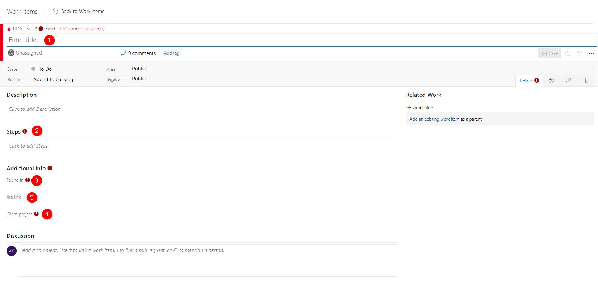
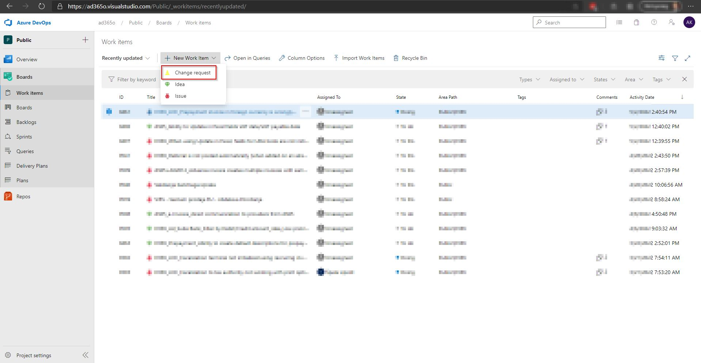
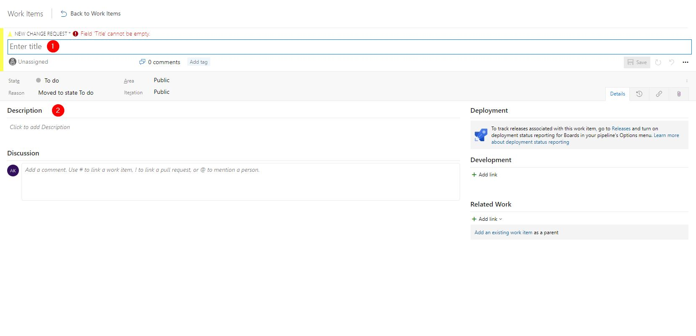
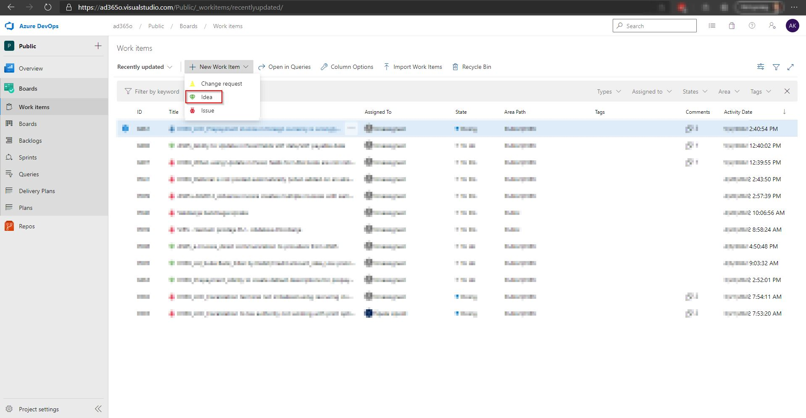
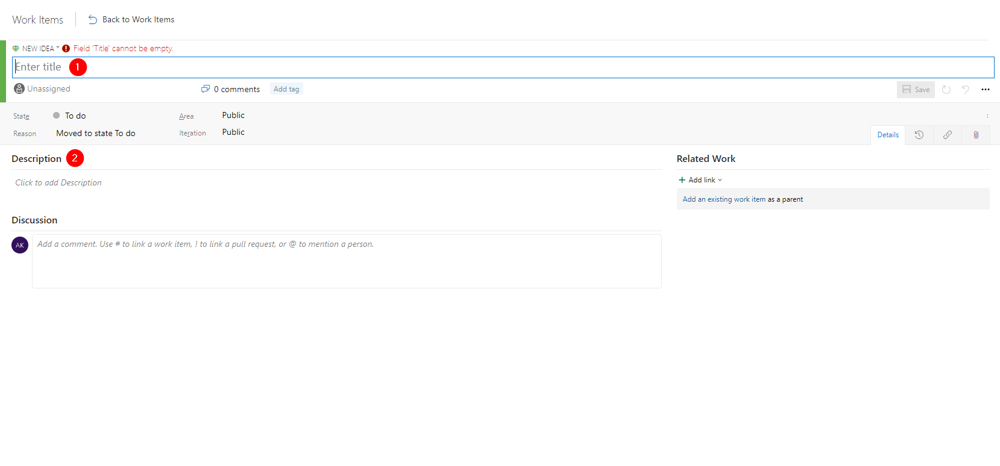

# Product support

Instructions on how to report different types of support requests

Support requests [**Issues**, **Change requests** and **Ideas**] can be submited via [Product Azure DevOps Board](https://ad365o.visualstudio.com/Public/_workitems/recentlyupdated/).

## Report an issue/bug 

1. In [Product Azure DevOps Boards](https://ad365o.visualstudio.com/Public/_workitems/recentlyupdated/) select **New work item**
2. In the dropdown select **Issue**

3. Fill out the required information

+ [1] Title
+ [2] Reproduction steps
+ [3] In which version of the application the issue was found (10.0.23 ...)
+ [4] Client project
+ [5] Jira ticket link if relevant

## Submit a change request

1. In [Product Azure DevOps Boards](https://ad365o.visualstudio.com/Public/_workitems/recentlyupdated/) select **New work item**
2. In the dropdown select **Change request**

3. Fill out the required information

+ [1] Title
+ [2] Description with as much details as possible

## Submit an idea

1. In [Product Azure DevOps Boards](https://ad365o.visualstudio.com/Public/_workitems/recentlyupdated/) select **New work item**
2. In the dropdown select **Idea**

3. Fill out the required information

+ [1] Title
+ [2] Description with as much details as possible

