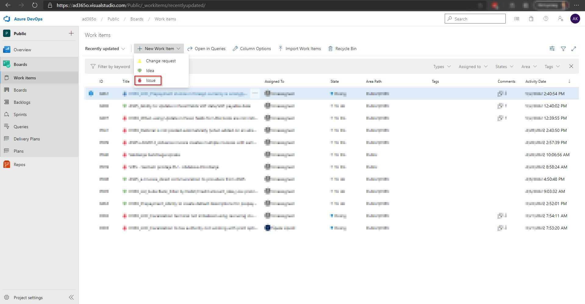

# Product support

Instructions on how to report different types of support requests

Support requests [**Issues**, **Change requests** and **Ideas**] can be submited via [Product Azure DevOps Board](https://ad365o.visualstudio.com/Public/_workitems/recentlyupdated/).

## Report an issue/bug 

1. In [Product Azure DevOps Boards](https://ad365o.visualstudio.com/Public/_workitems/recentlyupdated/) select **New work item**
2. In the dropdown select **Issue**

